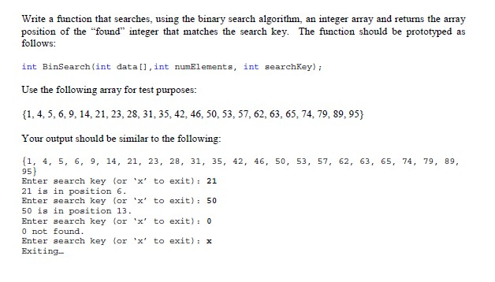

# AVERAGE

## Project Description
This project is an exercise in learning the C++ programming language. It is designed to solve a specific programming concept or problem.

## Problem Statement
This application provides the solution to the following problem:

> **Problem Description**

## How to Run
To run this project, follow these steps:

1. Open the project in your preferred C++ IDE or text editor.
2. Compile the source code file(s) containing the `main()` function.
3. Run the compiled executable file.
4. If required, provide any necessary input as prompted by the program.
5. Observe the program output in the console or terminal.

Note: You can either work with individual source code files or open the entire solution in your IDE. The choice depends on your preferred workflow and the project structure.

